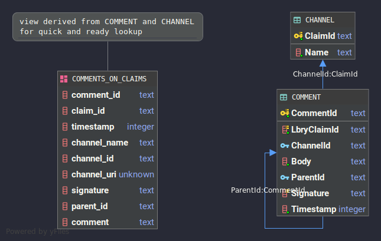

# LBRY Comment Server v2

This is a rewrite & update of the server 
[written by myself and Grayson Burton here](https://github.com/ocornoc/lbry-comments)

### Install & Setup

Clone the repo and install a virtual environement: 

```bash
# clone the repo
$ git clone https://github.com/osilkin98/comment-server

# create a virtual environment in any (current) version of python3.X
$ virtualenv --python=python3 venv
$ source venv/bin/activate 

# install the dependencies
(venv) $ pip install -r requirements.txt
```

### Running the server

Just run:
`(venv) $ python -m src.main.py`
and it should run automatically.


## Schema



## About
A lot of the design is more or less the same with the original,
except this version focuses less on performance and more on scalability. 

Rewritten with python because it's easier to adjust 
and maintain. Instead of doing any multithreading, 
this implementation just delegates a single 
database connection for write operations. 

The server was originally implemented with `aiohttp` 
and uses `aiojobs` for scheduling write operations.
As pointed out by several people, Python is a dinosaur 
in comparison to SQLite's execution speed, 
so there is no sensibility in multi-threading from the 
perspective of the server code itself. 


